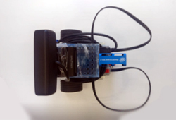
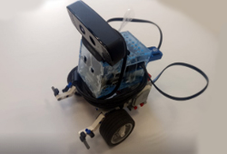
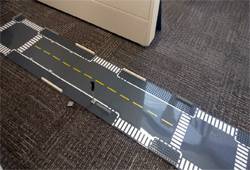
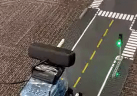

# Driving Pi
## Introduction
This app does autonomous LEGO car driving by classifying road segmentation and object detection for traffic light using Intel Movidius Neural Compute Stick 2.


## Prerequisites
The app requires the following hardware: 
1. 1 x Raspberry Pi 3 
2. 1 x INTEL NEURAL COMPUTE STICK 2 (NCS2)
3. 1 x BrickPi 3 - DEXTER
4. 1 x Web camera (USB) OR CameraPi
5. LEGO MINDSTORMS EV3 KIT
6. BrickStuff (for traffic light)
7. LEGO Roads set

 Connect the Raspberry Pi3 with BrickPi3 (DEXTER) - [Get started](https://www.dexterindustries.com/BrickPi/brickpi-tutorials-documentation/getting-started/), after installing the boards, start building the LEGO car using LEGO MINDSTORMS EV3 KIT - [step-by-step](https://le-www-live-s.legocdn.com/sc/media/lessons/mindstorms-ev3/building-instructions/ev3-rem-driving-base-79bebfc16bd491186ea9c9069842155e.pdf) (note that, don't install the board brick, we'll use the RaspberryPi and DEXTER instead).
 Build your LEGO road, and setup the traffic light on it.
 
 
 
 
 

## How to run the sample
To run the sample, change directory to the birds application folder and use the command: ```make run```



## Makefile
Provided Makefile has various targets that help with the above mentioned tasks.

### make run
Runs the sample application.

### make help
Shows available targets.

### make all
Builds and/or gathers all the required files needed to run the application.

### make data
Gathers all of the required data need to run the sample.

### make deps
Builds all of the dependencies needed to run the sample.

### make default_model
Compiles an IR file from a default model to be used when running the sample.

### make install-reqs
Checks required packages that aren't installed as part of the OpenVINO installation. 

### make uninstall-reqs
Uninstalls requirements that were installed by the sample program.
 
### make clean
Removes all the temporary files that are created by the Makefile.