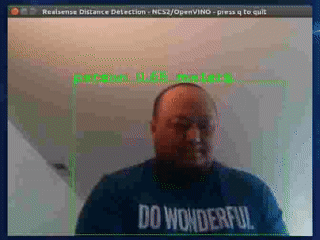

# realsense_object_distance_detection
## Introduction
This app does object detection using the [SSD Mobilenet Caffe model](../../networks/ssd_mobilenet_caffe/README.md), the [Intel Movidius Neural Compute Stick 2](https://software.intel.com/en-us/neural-compute-stick), [OpenVINO Toolkit R2](https://software.intel.com/en-us/openvino-toolkit) and the [Intel® RealSense™ depth camera](https://store.intelrealsense.com). It first detects an object in the video frame and then uses the depth stream to detect how far the object is using the Intel RealSense depth camera (tested with [Intel RealSense D415](https://www.intelrealsense.com/depth-camera-d415/)). The default model used in this sample uses the PASCAL Voc dataset and detects up to 20 classes. Please see the networks/ssd_mobilenet_caffe sample for more information.




## Prerequisites
This program requires:
- 1 [NCS2](https://store.intelrealsense.com/buy-intel-neural-compute-stick-2.html)/NCS1 device
- OpenVINO 2019 R2 Toolkit
- [Intel RealSense SDK 2.0](https://github.com/IntelRealSense/librealsense)
- Intel RealSense depth camera (tested with [Intel RealSense D415](https://store.intelrealsense.com/buy-intel-realsense-depth-camera-d415.html))

Note: All development and testing has been done on Ubuntu 16.04 on an x86-64 machine.

**Realsense SDK Note**:
You can install the Intel RealSense SDK 2.0 packages by running the command: **'make install-reqs'**.
This will install the following packages:
- **librealsense2-dkms** - Deploys the librealsense2 udev rules, build and activate kernel modules, runtime library.
- **librealsense2-dev** - Includes the header files and symbolic links for developers.

## Building the Example

To run the example code do the following :
1. Open a terminal and change directory to the sample base directory
2. Connect your Intel RealSense depth camera and NCS device.
3. Type the following command in the terminal: ```make all```

**Note**: Make sure your Intel RealSense libraries are installed beforehand. 

## Running the Example

After building the example you can run the example code by doing the following :
1. Open a terminal and change directory to the sample base directory
2. Type the following command in the terminal: ```make run``` 

When the application runs normally, another window should pop up and show the feed from the Intel RealSense depth camera. The program should perform inferences on frames taken from the Intel RealSense depth camera.

**Keybindings**:
- q or Q - Quit the application
- d or D - Show the depth detection overlay. The points that are checked for distance using the depth sensor in the Intel RealSense camera are shown as red dots. The closest point is shown as a green dot.
- a or A - Add more distance check points to the bounding box. 
- s or S - Subtract distance check points from the bounding box.


**Detection Threshold**:
You may need to adjust the DETECTION_THRESHOLD variable to suit your needs.

## Makefile
Provided Makefile has various targets that help with the above mentioned tasks.

### make run or make run_cpp
Runs the sample application.

### make help
Shows available targets.

### make all
Builds and/or gathers all the required files needed to run the application.

### make data
Gathers all of the required data need to run the sample.

### make deps
Builds all of the dependencies needed to run the sample.

### make default_model
Compiles an IR file from a default model to be used when running the sample.

### make install-reqs
Checks required packages that aren't installed as part of the OpenVINO installation. 

### make uninstall-reqs
Uninstalls requirements that were installed by the sample program.
 
### make clean
Removes all the temporary files that are created by the Makefile.

